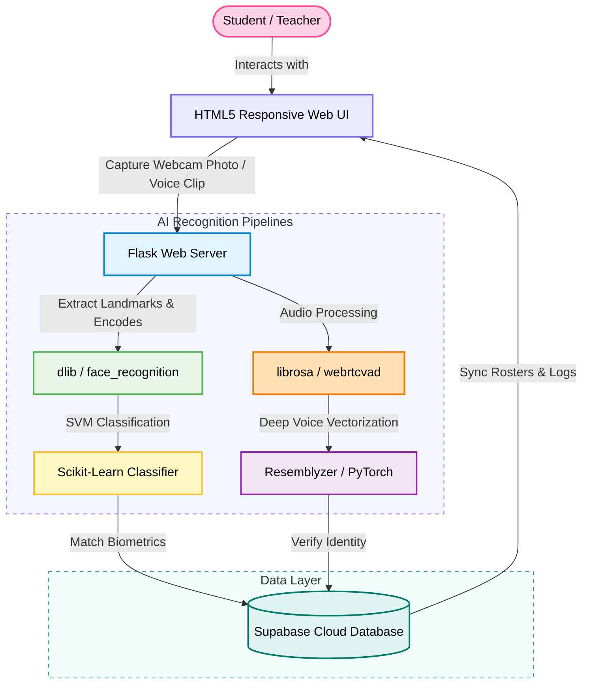

# 🎓 Fluentia: AI-Powered Biometric Attendance System

Fluentia is a state-of-the-art, secure, and fully responsive web application that automates classroom attendance using multi-modal biometrics: **Facial Recognition** and **Voiceprint Verification**.

<p align="center">
  
</p>

<p align="center">
  
  
  
  
  
</p>

---

## 🌟 Key Features

* **Dual-Modal Biometrics**: Authenticate students using state-of-the-art face recognition (`dlib` + SVM) and voice verification (`Resemblyzer` + PyTorch).
* **Live Classroom Scanning**: Teachers can capture a camera photo of the entire classroom, automatically recognize all registered students, and log attendance in one click.
* **Premium Dashboard & Analytics**: Beautiful responsive dashboards showing attendance rates, warning indicators (students below 75%), and historical charts.
* **Database Backend**: Secure cloud integration with Supabase for data rosters, subject enrollments, and real-time logs.
* **Fully Responsive Web UI**: Fits beautifully on desktop, tablet, and mobile browsers with a dedicated mobile bottom navigation layout.
* **Interactive REST API**: Pre-integrated dark-mode Swagger UI documentation.

---

## 📐 System Architecture

This diagram shows how student biometrics are captured, verified through our machine learning pipelines, and saved to the cloud database:



---

## 🛠️ Built With

### Web & Backend
*  **Flask** - Core web server and routing engine.
*  **Gunicorn** - High-performance production WSGI server.
*  **Supabase** - PostgreSQL cloud database and API middleware.
*  **Swagger UI** - Interactive REST API tester.

### Biometrics & AI
*  **PyTorch** - Neural network engine backing voice embeddings.
*  **Scikit-Learn** - Support Vector Machine (SVM) classification for face profiles.
*  **dlib & face-recognition** - Deep learning facial landmark detector.
*  **Librosa & webrtcvad** - Audio loading, voice activity detection, and speech feature processing.
*  **Pillow** - Image manipulation pipeline.

---

## 🚀 Quick Start

### Prerequisites
Before running, you need:
- A [Supabase Project](https://supabase.com/) with database tables configured.
- Environment variables configured in a `.env` file in the project root:
  ```env
  SUPABASE_URL=https://your-project.supabase.co
  SUPABASE_KEY=your-supabase-key
  ```

### Option A: Local Run (Direct python)
1. **Initialize Environment**:
   ```powershell
   Set-ExecutionPolicy -Scope Process -ExecutionPolicy RemoteSigned
   .\scripts\setup_environment.ps1
   .\.venv\Scripts\Activate.ps1
   ```
2. **Launch Server**:
   ```powershell
   python app.py
   ```
3. Open `http://localhost:5000` in your web browser.

### Option B: Local Run (Docker Compose)
Build and spin up the production container configuration locally:
```bash
docker compose up --build
```
Open `http://localhost:5000` in your browser.

---

## ☁️ Production Deployment

The project is preconfigured to deploy directly to **Render** using Docker:

1. Connect your repository to your **Render Account**.
2. Render will automatically parse [render.yaml](render.yaml) and configure the **Docker Web Service** using the optimized [Dockerfile](Dockerfile).
3. Input the required environment variables (`SUPABASE_URL` and `SUPABASE_KEY`) in the Render configuration dashboard.
4. Render will compile dependencies (compiling `dlib` via single-core to prevent OOM errors) and bring your secure, HTTPS-enabled portal live in 10-15 minutes.
